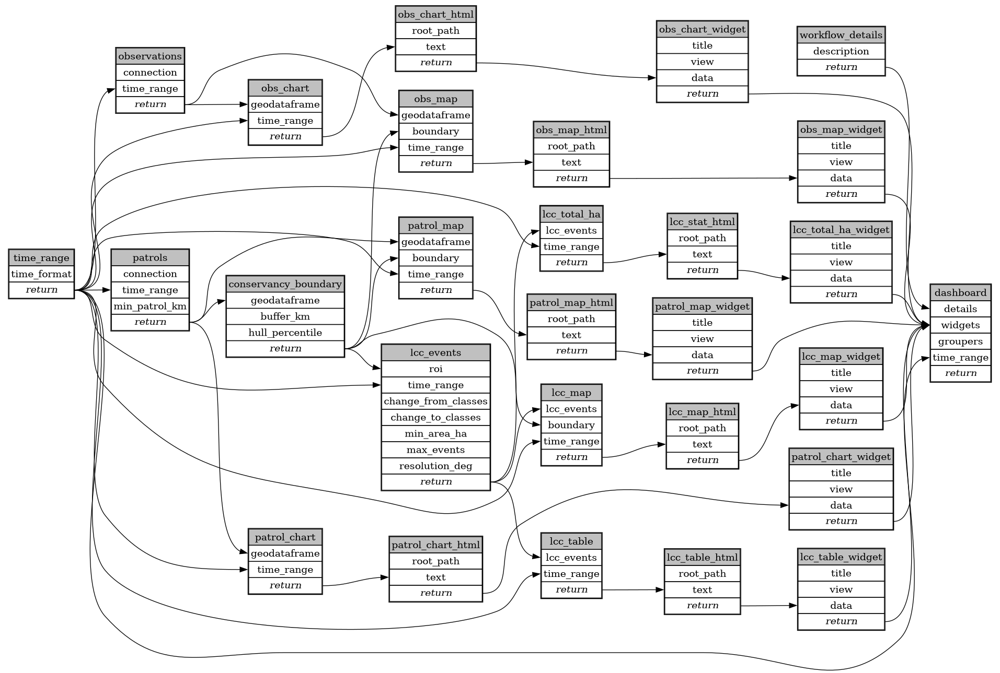

```
# AUTOGENERATED BY ECOSCOPE-WORKFLOWS; see fingerprint in README.md for details

```

```yaml
# fingerprint:
artifacts_sha256_basic: ecfa0fbd18949573cd9d88c720c1173a947ad5d997d9d1180b28c0f85b3c3323
artifacts_sha256_strict: 1389a2164b16d3d0706b231d2e858eafd42b46ddab9dc1b918002785631955cc
installed_requirements:
- channel: https://repo.prefix.dev/ecoscope-workflows/
  name: ecoscope-platform
  version: {version: ==2.11.6}
params_sha256: 27d342d4928fca03e8b86ba6767294c23e9024488d9777d0110d35dfb020f593
spec_sha256: 3d23ef796476e049b4d80d7a326f831b4a709398d9ed1b346e881b6427f0ba67

```

# ecoscope-workflows-ccfn-smart-download-esri-workflow


