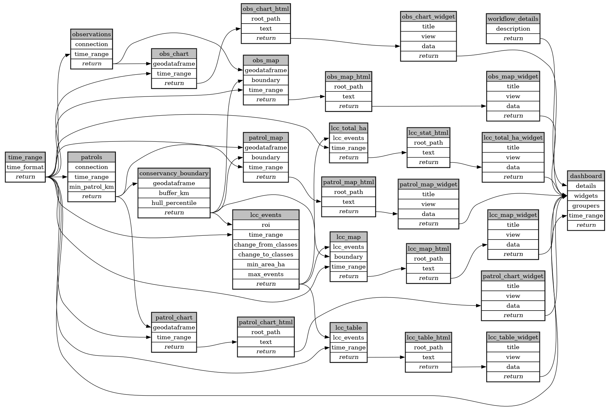

```
# AUTOGENERATED BY ECOSCOPE-WORKFLOWS; see fingerprint in README.md for details

```

```yaml
# fingerprint:
artifacts_sha256_basic: dd965a0ddaf9c545f6ea7156955c35565ef0b0344bf35cdbf53ba5be79f93839
artifacts_sha256_strict: c6b9243f9698646fe4fad470cf465168fb41ab73d4c73eaf762819ff0a9c3a13
installed_requirements:
- channel: https://repo.prefix.dev/ecoscope-workflows/
  name: ecoscope-platform
  version: {version: ==2.11.6}
params_sha256: 27d342d4928fca03e8b86ba6767294c23e9024488d9777d0110d35dfb020f593
spec_sha256: e57ca6064b12f15d926d5ec1c8b7bf1a793ab8df71efb7b24dbaded449d4ffcf

```

# ecoscope-workflows-ccfn-smart-download-workflow


